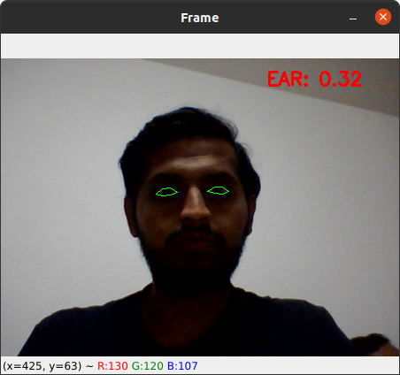

# Driver Drowsiness Detector
A computer vision system that can automatically detect driver drowsiness in a real-time video stream and then play an alarm if the driver appears to be drowsy.

## The drowsiness detector algorithm
The general flow of the drowsiness detection algorithm is:
1. Setup a camera that monitors a stream for faces
2. If a face is found, apply facial landmark detection and extract the eye regions
3. Compute the eye aspect ratio to determine if the eyes are closed
4. If the eye aspect ratio indicates that the eyes have been closed for a sufficiently long enough amount of time, sound an alarm

Detecting facial landmarks is a two step process:
1. Localize the face in the image (done by applying a pre-trained HOG + Linear SVM object detector)
2. Detect the key facial structures on the face ROI (done by applying SURF feature extraction)

## Pre-requisites
Install the following libraries to run the code:
1. scipy
2. imutils
3. threading
4. numpy as np
5. playsound
6. argparse
7. time
8. dlib
9. cv2

The dlib library ships with a Histogram of Oriented Gradients-based face detector along with a facial landmark predictor. The pre-trained facial landmark detector is used to estimate the location of 68 (x, y)-coordinates that map to facial structures on the face. Therefore, to extract the eye regions from a set of facial landmarks, its array must be sliced with the correct indices to extract the eye regions.

## Testing the code
1. Open CMD or any Python prompt
2. Type the following: python detect_drowsiness.py --shape-predictor shape_predictor_68_face_landmarks.dat --alarm alarm.wav

## Example output

